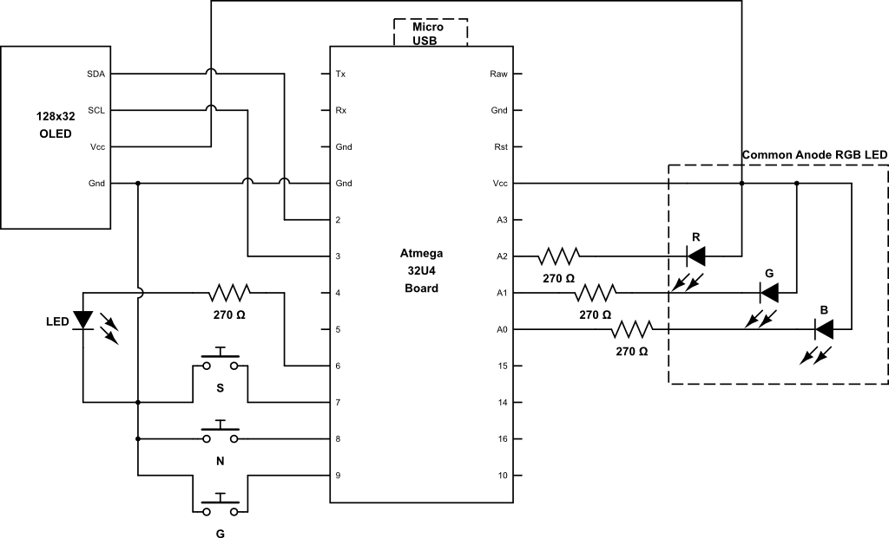

# Circuit

The circuit for the PT model U is shown below.  The microprocessor board 
is a generic 32U4 "Leonardo" compatible board with a micro-usb connector. 
The board is available from Aliexpress and other vendors.  

*PT-U circuit diagram*

The RGB LED is a common-anode one.  Resistor values can be tweaked to change brightness. 

The circuit for the model A is the same, excpet that it uses a smaller board 
(sometimes called 'beetle' by online vendors.  The connector is USB-A of course. 

Note  that you would typically not wire in an OLED display for a model A
(although it is supported).  The buttons are connected to D9, D8 and D7 
as opposed to D9, D10, D11 in the  model U.  You may wish to ommit the middle ("Next")
button on a model A, to allow the use of larger buttons, since a long press of "Select" 
has the same functionality.  

Finally, the model A board has a  build-in LED on D6, so no need to connect an external 
monochrome LED.  

# Assembly
Any small momemtary pushbutton switches can be used for the buttons, and the project 
can be assembled many ways.  The photos below (TBD) show the front and back of model U and A
assemblies.  The "sandwhich" construction of the model U shown is very compact and allows 
the unit to be glued to your keyboard for easy access.  (Only do this at home of course).

# Software Build
The platformio platform is recommended for compiling the code.  Ensure that
support for the Arduino Leonardo board is installed.  

There is a separate build specification for each of the two board types. 
Ensure that you build the correct one for your board, otherwise the 
buttons and led will not work correctly. 

