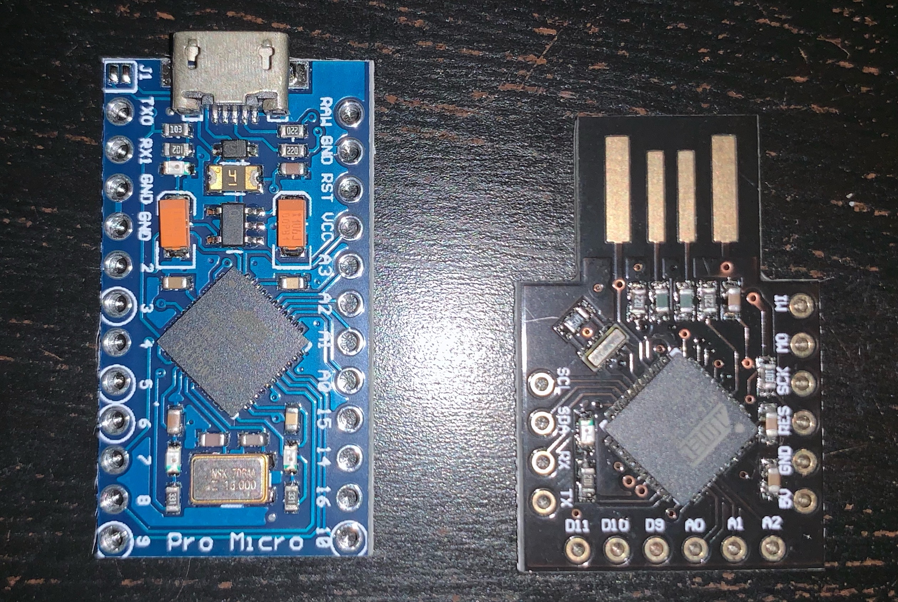
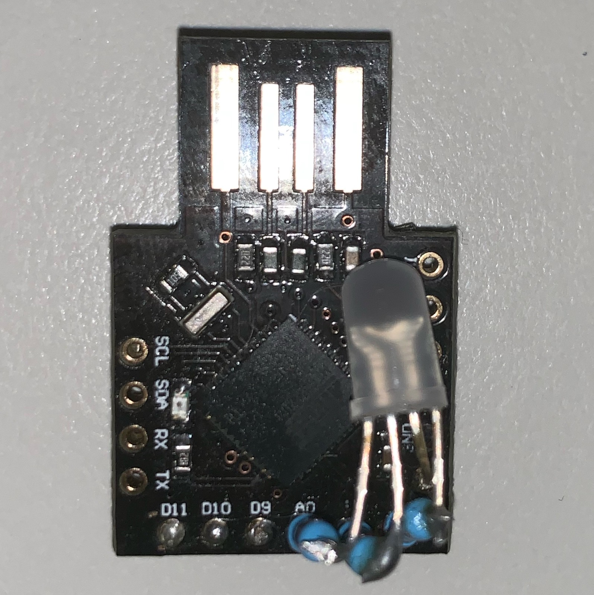
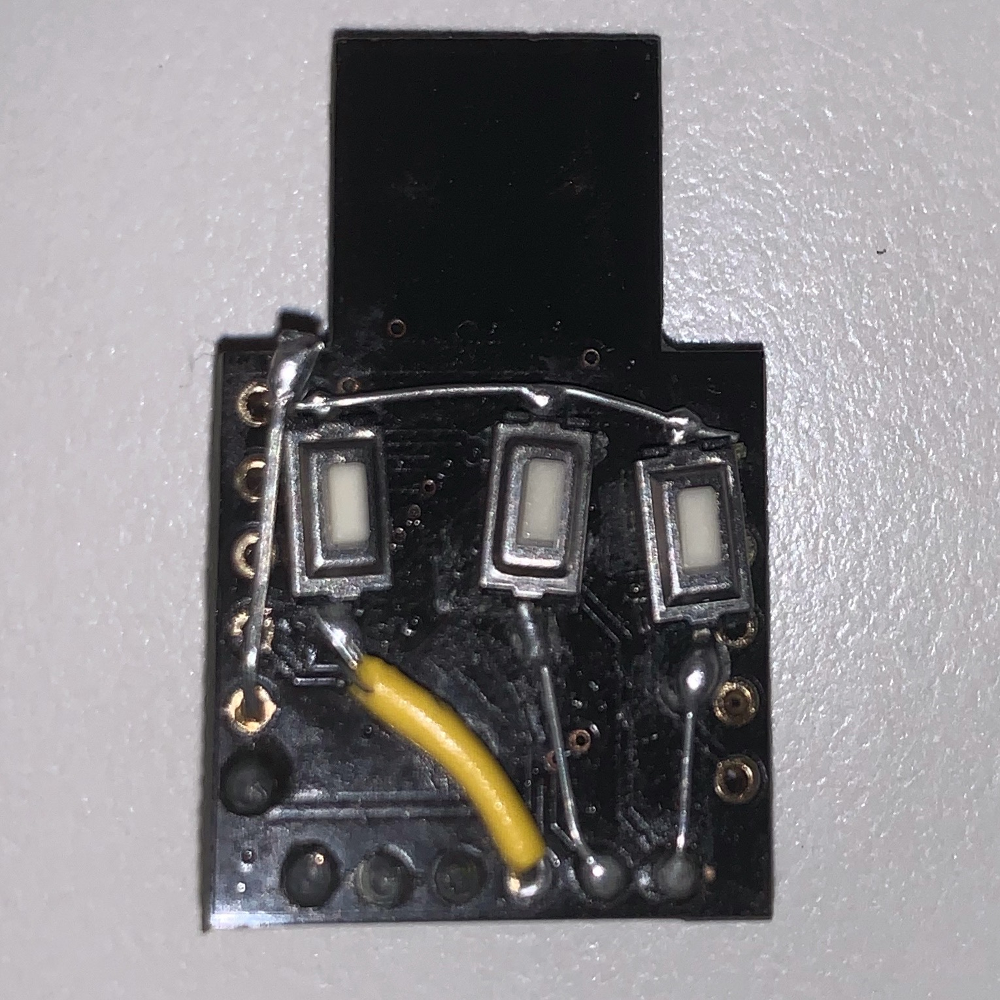
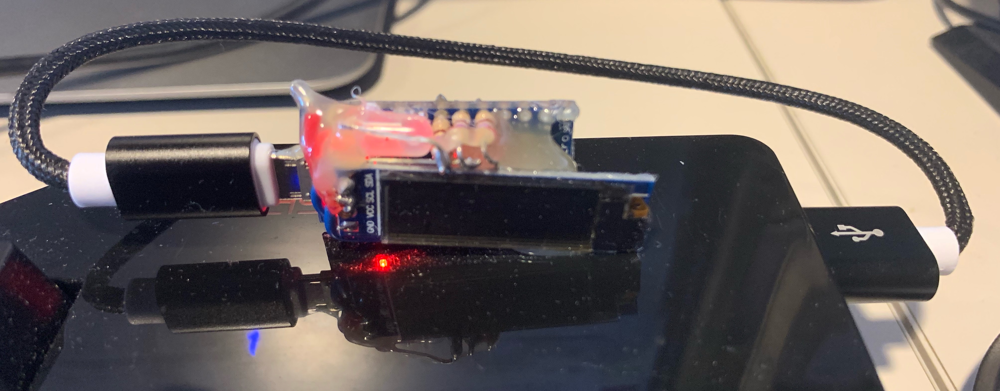
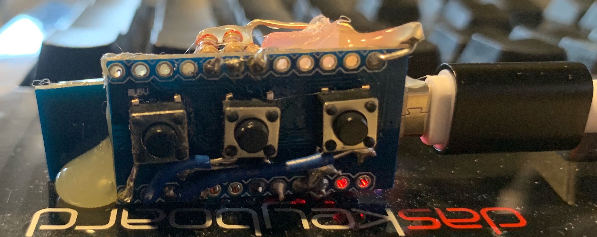

# Circuit

The circuit for the PT model U is shown below.  The microprocessor board 
is a generic ATmega 32U4 "Leonardo" compatible board with a micro-usb connector. 
The board is available from Aliexpress and other vendors.  

Note that boards like Arduino Nano and similar, which use a 328P processor,
will not work, since the operation of the project depends on the 32U4's
ability to act as a USB HID device, emulating a keyboard. 

*PT-U circuit diagram*

The circuit for the model A is the same as shown above, except that it uses
a smaller board with a USB A interface.  

Here are the bare boards used for the U and A versions of the project.  

*Boards used for model U (left) and A (right)*

Other components needed are:
	- A common-anode RGB LED (you can use common cathode, but then you
	  need to adjust the wiring and code appropriately).
	- A 270 ohm resistor for the R, G and B led channels. The value nay be
	  tweaked to change brightness. 
        - A monochrome LED, and another 270 ohm resistor for model U. 
	- Three momentary push button switches.  
        - An optional  128x32 I2C OLED display. 

Note  that you would typically not wire in an OLED display for a model A
(although it is supported).  The buttons are connected to D9, D8 and D7 in
model A, as opposed to D9, D10, D11 in the  model U.  You may wish to ommit 
the middle ("Next") button on a model A, to allow the use of larger buttons, 
since a long press of "Select"  has the same functionality.  

Finally, the model A board has a  build-in LED on D6, so no need to connect an external 
monochrome LED.  

# Assembly
The project can be assembled many ways.  A custom 3D-printed case is probably
the best solition in the long term.  

The photos below  show the front and back of two of my prototype model U and A
assemblies.  The "sandwhich" construction of the model U shown is very compact and allows 
the unit to be glued to your keyboard for easy access.  (Only do this at home of 
course - see the Security section in the documentation).

Assembled model A board.

*Model A top view*

*Model A bottom view*

In this instance, I installed three buttons, but I found it akward to use.  
I hihgly recommend  using larger buttons, like in the model U example below,
and using only two of them (#1 and #3) .  

The images below show an example of an assembled model U board. 

*Model U front view*

*Model U back view*

# Software Build
The platformio platform is recommended for compiling the code.  Ensure that
support for the Arduino Leonardo board is installed.  

There is a separate build specification for each of the two board types. 
Ensure that you build the correct one for your board, otherwise the 
buttons and led will not work correctly. 

# Documentation
This documentation was generated with mkdocs.  There is a yaml file in the root of 
the repository. 

# Coding Style and future development
The code started off as a FreeRTOS project, written in C, which is reflected
in the lack of C++ feature usage, and some naming conventions.  FreeRTOS was 
eventually dumped to free up flash space for features, and because the
application is not time critical at all.  

The remnants of the RTOS origin of the code can be seen in the main 'Task'
for each major function, that is now simply periodically called in the main
loop. Works fine as it is, but there is potentially room for optimization
there.  

