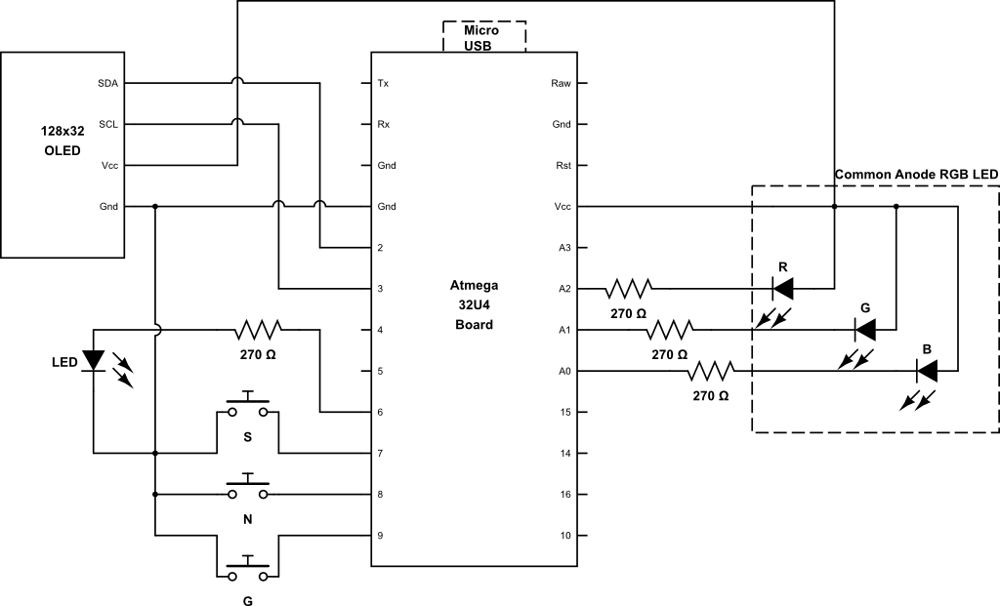

# Circuit

The circuit for the PT model U is shown below.  The microprocessor board 
is a generic 32U4 "Leonardo" compatible board with a micro-usb connector. 
The board is available from Aliexpress and other vendors.  

*PT-U circuit diagram*

Here are the bare boards used for the U and A versions of the project.  

!Boards](img/boards.jpg)
*Boards used for model U (left) and A (right)*

The RGB LED is a common-anode one.  Resistor values can be tweaked to change brightness. 

The circuit for the model A is the same as shown above, , except that it uses the smaller board 
(sometimes called 'beetle' by online vendors).  

Note  that you would typically not wire in an OLED display for a model A
(although it is supported).  The buttons are connected to D9, D8 and D7 
as opposed to D9, D10, D11 in the  model U.  You may wish to ommit the middle ("Next")
button on a model A, to allow the use of larger buttons, since a long press of "Select" 
has the same functionality.  

Finally, the model A board has a  build-in LED on D6, so no need to connect an external 
monochrome LED.  

# Assembly
Any small momemtary pushbutton switches can be used for the buttons, and the project 
can be assembled many ways.  The photos below  show the front and back of model U and A
assemblies.  The "sandwhich" construction of the model U shown is very compact and allows 
the unit to be glued to your keyboard for easy access.  (Only do this at home of course
-  see the Security section in the documentation).

The images below show an example of an assembled model A board.

*Model A top view*

*Model A bottom view*

In this instance, I installed three buttons, but I found it akward to use.  
I hihgly recommend  using larger buttons, like in the model U example below,
and using only two of them (#1 and #3) .  

The images below show an example of an assembled model U board. 

*Model U front view*

*Model U back view*

# Software Build
The platformio platform is recommended for compiling the code.  Ensure that
support for the Arduino Leonardo board is installed.  

There is a separate build specification for each of the two board types. 
Ensure that you build the correct one for your board, otherwise the 
buttons and led will not work correctly. 

# Documentation
This documentation was generated with mkdocs.  There is a yaml file in the root of 
the repository. 

# Coding Style
Hey, I learned C++ shortly after it was invented, in the 90s, and I am sure
that is reflected in my coding style.    I am aware of recent developments 
in the language, which could make this code much more compact and efficient, 
but this is a hobby project and I have a day job.  Feel free to submit
improvements.  

